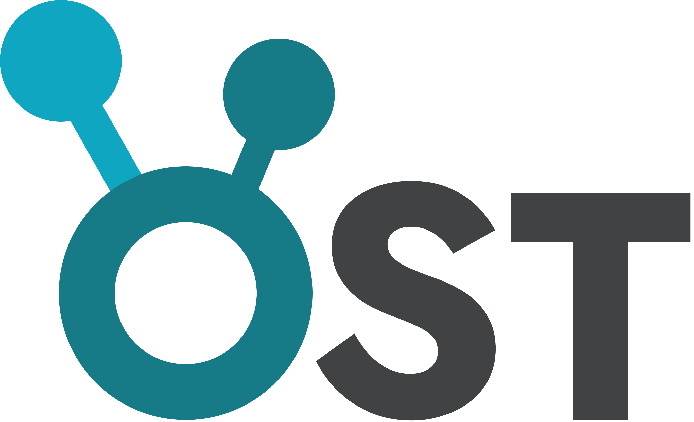

# OST Suite 

<p align="left"></p>

#### Osteo-Skeletal Tracker

A portable, modular workstation for recording, processing, and visualizing skeletal motion data using Intel RealSense and MediaPipe.


---

## 🛠 Features

### 📷 OST Recorder

* Auto-detects Intel RealSense cameras
* Real-time skeletal overlay (MediaPipe Pose)
* Depth-aligned 3D coordinate export

### 📊 OST Studio

**Data Prep**

* Auto-repair gaps using interpolation
* Smooth jittery skeletal data

**Visualizer**

* Interactive 3D skeleton playback
* Synchronized metric graphs (Flexion, Trunk Lean, etc.)

### 📦 Portable

Runs as a standalone application.

---

## 📥 Installation

### For Users (Lab Machines)

1. Download the latest **Release** from the repository sidebar.
2. Extract the ZIP file.
3. Open the folder and run **OST Launcher.exe**.

**Note:**
If the app fails to start, ensure the Microsoft Visual C++ Redistributable is installed.

---

### For Developers

#### 1. Clone the Repository

```bash
git clone https://github.com/yourusername/OST-Suite.git
cd OST-Suite
```

#### 2. Create a Virtual Environment

```bash
python -m venv .venv
.\venv\Scripts\activate
```

#### 3. Install Dependencies

```bash
pip install -r requirements.txt
```

#### 4. Run in Development Mode

```bash
python main.py
```
---

## 🏗️ Building From Source

This project uses a custom PyInstaller setup.

### 1. The Build System

The build is controlled by `studio.spec`

* **Runtime Hooks (`core/hook_fix.py`)**
  Workaround for the known issue with MediaPipe libraries. Prevents crash caused by DLL load conflict

* **Manifest Injection**
  Can be changed if build for Linux machines

* **Folder Cleanup**
  Hides internal executables and libraries inside a `libs/` folder.

---

### 2. Build Command

To generate a fresh executable:

```bash
# 1. Clean previous builds
rmdir /s /q build dist

# 2. Run the spec file
pyinstaller studio.spec
```
The output will be located in:

```dist/OST Suite```

---