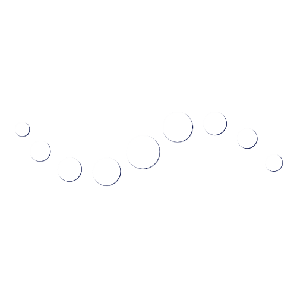

# OST Suite 

#### Human Osteo-Skeletal Tracker

OST Suite is a high-performance, distributed workstation for recording, processing, and visualizing multi-modal skeletal kinematics and micro-Doppler radar data. 

> **⚠️ Beta Release:** Version 0.3.0-beta.1 introduces standalone `.exe` packaging. Please report any bugs or errors in the Issues tab.

---

## The Three Core Modules

### 🛰️ OST Streamer
The hardware-interfacing node. Captures and encrypts live radar and camera telemetry.

### 🖥️ OST Viewer
The live monitoring dashboard. High-speed visualization of encrypted network streams.

### 🧪 OST Studio
The offline analysis laboratory. A specialized workbench for post-processing recorded `.parquet` sessions.

---

## Quick Start (Standalone Beta)

1. **Download:** Get the latest release `.zip` and extract it.
2. **Configure:** Rename `settings-template.ini` to `settings.ini` inside libs directory.
3. **Security Keys:** Run the Keygen tool through `Studio.exe` to generate Curve25519 keys. Paste the output into your `settings.ini`.
4. **Launch:** Launch modules

---

## Running the Suite

Ensure your hardware is plugged in and `settings.ini` has the correct COM ports and IPs defined.

* **Start Hardware Capture:** Launch **Streamer**. *(Note: Radar and Camera streams should be run in separate terminals or computers).*
* **Watch Live Feed:** Launch **Viewer** to monitor the encrypted network stream.
* **Analyze Recorded Data:** Launch **Studio** to analyze saved data files offline.

---

## Developer Setup

If you prefer to run from source code:

1. Clone the repository and create a Python 3.11 virtual environment.
2. `pip install -r requirements.txt`
3. Generate keys: `python core/studio/keys.py`
4. Setup `settings.ini` as described at the beginning of this file
4. Run modules directly

## ⚙️ Supported Hardware

**Texas Instruments IWR6843ISK**
A 60-GHz mmWave radar sensor. It captures high-resolution 3D point clouds and micro-Doppler signatures, which are essential for the suite's non-intrusive skeletal tracking and velocity analysis.

**Intel RealSense D435i**
An advanced RGB-Depth camera with an integrated internal IMU. It provides the high-fidelity spatial video streams required to calculate precise multi-modal skeletal kinematics and joint angles.

## 🤝 Contributing

We love community contributions, especially for the OST Studio UI and data analysis features! 

To keep the system stable, we have specific rules about what can be merged. 
Please read through [Contributing Guidelines](CONTRIBUTING.md) before opening an issue or Pull Request. 

By participating in this project, you agree to abide by our [Code of Conduct](CODE_OF_CONDUCT.md).
